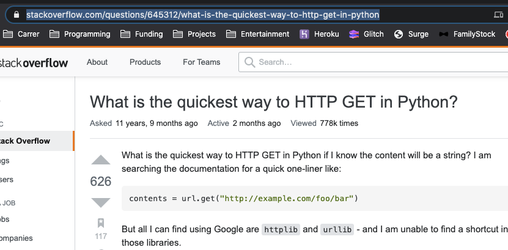

# 5848cf8a7dd2-wahaha

#

sudo yum install git

#
Q1.​ Access​ Log​ analytics
#
1. Count​ the total​ number​ ​of HTTP​ requests​ recorded​ by​ this​ access​ logfile
2. Find​ the top-10​ (host)​ hosts​ makes​ most​ requests​ from​ 2019-06-10​ 00:00:00​ to
2019-06-19​ 23:59:59,​ inclusively
3. Find​ out the​ country​ with​ most​ requests​ originating​ from​ (according​ ​to the source​
IP)
#
prerequisite: \
Install Git :
```sudo yum install git -y```
Install 
```sudo yum install jq -y``` 

Clone Git Souce: ```git clone https://github.com/LamLauChiu/5848cf8a7dd2-wahaha.git```
#
Q1.1 Count​ the total​ number​ ​of HTTP​ requests​ recorded​ by​ this​ access​ logfile
#
Answer: \
Go to Quesiton1 Folder : ```cd 5848cf8a7dd2-wahaha/Question1/```

Run the Script: ```. Q1.1-answer.sh``` 

Output: 


#
Q1.2 Find​ the top-10​ (host)​ hosts​ makes​ most​ requests​ from​ 2019-06-10​ 00:00:00​ to
2019-06-19​ 23:59:59,​ inclusively
#
Answer: \

Run the Script: ```. Q1.2-answer.sh``` 

Output: 


| No. of Requests Counted  | Ip Address |
| --- | --- |
| 730 | 1.222.44.52 |
| 730 | 118.24.71.239 |
| 723 | 119.29.129.76 |
| 486 | 148.251.244.137|
| 440 | 95.216.38.186 |
| 440 | 136.243.70.151 |
| 437 |213.239.216.194 |
| 436 | 5.9.71.213 |
| 436 |5.189.159.208|
| 406 | 5.9.108.254 |
#
Q1.3 Find​ out the​ country​ with​ most​ requests​ originating​ from​ (according​ ​to the source​
IP)
#
Answer: \

Run the Script: ```. Q1.3-answer.sh``` 

Output: 


| No. of Requests Counted  | Ip Address | Country |
| --- | --- | -- |
| 730 | 1.222.44.52 | KR |
| 730 | 118.24.71.239 | CN |
| 723 | 119.29.129.76 | CN |
| 486 | 148.251.244.137| DE | 
| 440 | 95.216.38.186 |  DE |
| 440 | 136.243.70.151 |  DE |
| 437 |213.239.216.194 | DE |
| 436 | 5.9.71.213 | DE |
| 436 |5.189.159.208| DE |
| 406 | 5.9.108.254 | DE |

Remark: \
DE = Deutschland \
CN = China \
KR = Korea 
#
Q2.​ AWS​ API​ programming
#
Please​ help​ to​ prepare​ a script​ to​ query​ AWS​ API​ and​ look up the public​ IP​ of the instance​ with the​ specific​ EC2​ Name​ tag.​ Then​ the script​ should​ execute​ the ssh​ command 
 
ssh​ ec2-user@EC2_PUBLIC_IP​ .
#
prerequisite: \

1. Setup on macOS or Linux:
- Creating a virtual environment:  \
```python3 -m venv virtualEnvironment```
- Activating a virtual environment: \
```source virtualEnvironment/bin/activate```
- Install the lists of requirements: \
```pip install -r requirements.txt```

2. Pepare the ec2-keypair.pem key file in put it inside "5848cf8a7dd2-wahaha/Question2/" directory

3. Create the instances in AWS and Add the Name of tag as "api-server-002"

#

Answer: \
Go to Quesiton1 Folder : ```cd 5848cf8a7dd2-wahaha/Question2/```

To test the successful case by running the Script: \
```python Q2-answer.py api-server-002``` 

Output:


To test the not-exiting-host case by running the Script: \
```python Q2-answer.py not-exiting-host```

Output:

#

Q3. System design and Implementation

Implement​ a simple​ bit.ly​ like​ service,​ name​ the following​ 2 RESTful​ endpoints

#
prerequisite:

Setup local environemt on macOS or Linux:
- Creating a virtual environment:  \
```python3 -m venv virtualEnvironment```
- Activating a virtual environment: \
```source virtualEnvironment/bin/activate```
- Install the lists of requirements: \
```pip install -r requirements.txt```

#

Test Local run app:
#

```cd /5848cf8a7dd2-wahaha/Question3/shorturlApp/```

```python app.py```
Output:

Local Test ShortUrl Function:
#


#
Build docker image:
#

```docker build -t short_url_app:latest .```

```docker run -d -p 5000:5000 --name short_url_app short_url_app:latest```

#
Create a repository in ECR:
#

#

Soucre:
https://towardsdatascience.com/how-to-use-docker-to-deploy-a-dashboard-app-on-aws-8df5fb322708

1.Retrieve an authentication token and authenticate your Docker client to your registry.
Use the AWS CLI:

```aws ecr get-login-password --region <REGION> | docker login --username AWS --password-stdin <ACCOUNT NUM>.dkr.ecr.<REGION>.amazonaws.com```

2.Build your Docker image using the following command. For information on building a Docker file from scratch see the instructions here . You can skip this step if your image is already built:

```docker build -t shorturl .```

3.After the build completes, tag your image so you can push the image to this repository:
```docker tag shorturl:latest <ACCOUNT NUM>.dkr.ecr.<REGION>.amazonaws.com/shorturl:latest```

4.Run the following command to push this image to your newly created AWS repository:
```docker push <ACCOUNT NUM>.dkr.ecr.<REGION>.amazonaws.com/shorturl:latest```

#

#

Creating AWS cloudformation Stack network arichecture: 


```
aws cloudformation create-stack \
  --stack-name reflectoring-shorturl-network \
  --template-body file://network.yml \
  --capabilities CAPABILITY_IAM
```
#

#

Creating AWS cloudformation Stack Service arichecture: 


#

```
aws cloudformation create-stack \
  --stack-name reflectoring-shorturl-service \
  --template-body file://service.yml \
  --parameters \
      ParameterKey=StackName,ParameterValue=reflectoring-shorturl-network \
      ParameterKey=ServiceName,ParameterValue=reflectoring-shorturl \
      ParameterKey=ImageUrl,ParameterValue=public.ecr.aws/s4q3b8r4/shorturl-app:latest \
      ParameterKey=ContainerPort,ParameterValue=8080 \
      ParameterKey=HealthCheckPath,ParameterValue=/home \
      ParameterKey=HealthCheckIntervalSeconds,ParameterValue=90
```
#


#
Testing AWS redirect from ALB DNS:
#


Testing POST api call from Postman to generate shortUrl link:
#

#
#
Testing AWS App Alive:

Paste this URL into the browser, and add /home to the end, and you should see the Home page!


#

Testing ShortUrl not existing case:
#


#
Testing ShortUrl successful redirect case:
#



#
Deleting the Stacks after all finished
#
When we’re done, we can delete the stacks:

```
aws cloudformation delete-stack \
  --stack-name reflectoring-shorturl-service
```

Wait a bit until the service stack has reached the status DELETE_COMPLETE before deleting the network stack:

```
aws cloudformation delete-stack \
  --stack-name reflectoring-shorturl-network
```


#

TBC

#


For further improvement:


TODO: The shell script can be implemnt with jenkins CICD or AWS CloudPline